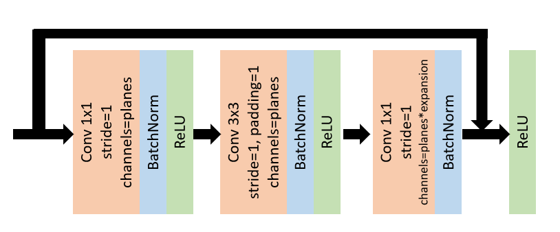
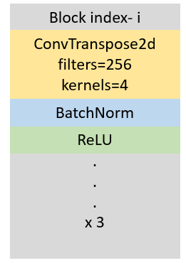

# Facial Action Unit Detection

Facial Action Units or FAUs are specific regions of the face which allow one to estimate the intensity and type of emotion one is experiencing in an image. Each facial movement in the FAU coding system is encoded by its appearance on the face. AU coding starts from 0 and ends at 28 with 0th code representing a neutral face. While there are various FAUs present in the FAU coding system most applications use only a few of them to characterize emotions. These FAUs are commonly referred to as Main FAUs. For instance, the AU code for *cheek raise* (AU6) and *lip corner pull* (AU12) when combined together give the *happiness* (AU6+12) emotion. As another example, the AU codes *inner brow raise* (AU1), *brow low* (AU4) and *lip corner depress* (AU15) together give the *sadness* (AU1+4+15) emotion. AU codes start from 0 and end at 28 with the 0th code corresponding to *neutral face*. A complete list of AU codes and their corresponding facial expressions can be found on [Wikipedia](https://en.wikipedia.org/wiki/Facial_Action_Coding_System). 

A slight modification of the deep ResNet architecture pretrained on BP4D FAU dataset is utilized to predict the intensity of the facial expressions. The intensity labels for each AU range from 0 to 5 on a discrete integer scale.

The repository contains following files- 
* `train.py`, `nerwork.py` and `run_demo.py` - These files are used to implement ResNet and train our model on a sample data for FAU Intensity prediction.   
* `procrustes.py`- For performing procrustes analysis (facial alignment).  
* [model.pth](https://drive.google.com/file/d/1XYCoLtApTHq89_s3gf6Lh6U2kMP80oCH/view?usp=sharing) - Trained model on BP4D data

Figure (left) presents modified the ResNet architecture consisting of bottleneck residual blocks and deconvolutional layers. The ResNet module is contained in the `ResNet` class which consists of `_make_deconv_layer` function. The `_make_deconv_layer` constructs a deconvolutional block by omitting the residual connections and replacing convolutions with deconvolutions (`ConvTranspose2d`). Figure (right) presents a single deconvolutional block consisting of 3 sub-blocks each having `ConvTranspose2d`, BatchNorm and ReLU layers. 